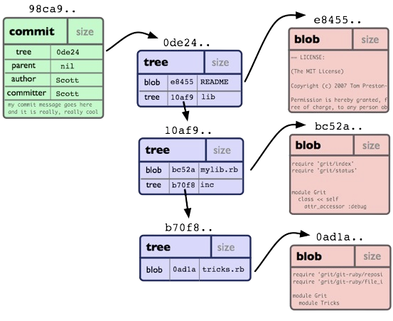

<!DOCTYPE html>
<html>
<head>
    
</head>
<body>

### Ветвление в Git

---

Суть ветвеления состоит в: 

 **возможности отклониться от основной линии разработки и внедрять функционал, не затрагивая рабочий проект.**

 Давайте подробнее разберем то, как **Git** хранит данные.Ранее уже говорилось о том, что **Git** хранит историю изменений в виде снимков(снапов) всего проекта.Когда вы делаете коммит(фиксируете изменения в локальной базе), то **Git** создает объект коммита, который хранит указатель на снимок(**при чем снимок может содежать ссылки на файлы из предыдущего снимка или более раннего, также и те файлы , которые изменились**), а также набор дополнительных данных.Также коммит содержит в себе информацию об авторе, информацию о email, комментарии к этому коммиту, также содержит указатель на предыдущий коммит или на несколько коммитов.

 

 Как видно из картинки, есть объект коммита, он ссылается на объект дерева снимков, каждый объект дерева снимков указывает на свой набор файлов(так называемые блобы-большие двоичные файлы).

 Далее все объекты коммитов связываются во единую цепь.

 

 Из картинки видно, что каждый коммит связан с предыдущим коммитом, и каждый коммит содержит указатель на объект дерева снимков.Таким образом у нас последовательно выстривается цепочка коммитов, которая позволяет нам сохранять состояние проектов.Поэтому откатываясь на какой-то определенный коммит, мы просто восстанавливаем проект в том виде, в котором он был на момент коммита.

 ---

 **Что же такое ветки**

 Ветка-простая ссылка на один из коммитов

 

 Мы видим что master ссылается на коммит, а на мастер ссылается **HEAD**, двигая **HEAD** мы перемещаемся на другую ветку , например можно переключиться на ветку testing.Ветка master не всегда будет указывать на последний коммит в ветке, то есть при каждом коммите ссылка будет перемещаться на коммит.

 Если ввести команду `git log`, мы увидим, что у последнего коммита ссылка идет от ветки master.

 ---

 **Создание новой ветки**

 По сути это создание еще одной ссылки на коммит, просто с другим именем.

    Например:

    У нас есть три коммита, есть ветка master, которая указывает на коммит и есть новая ветка(ссылка), на тот же коммит что и у master.

Команда для создания новой ветки:

`git branch <branch-name>`

В нашем случае ветка имеет название **testing**.Если ввести команду `git log`, то в последнем коммите мы увидим , что помимо ветки **master**, на последний коммит ссылается еще и новая ветка **testing**.

Если вы хотите создать ветку и аатоматически на нее переключиться, то можно использовать команду:

`git checkout -b <branch-name>`

Для переключения можно использовать:

`git checkout <branch-name>`

Также можно использовтаь команду:

`git switch <branch-name>`

для переключения на ветку и 

`git switch -c <branch-name>`

для создания новой ветки и переключения на нее.

Вывести уже существующие ветки можно командой:

`git branch`

Команда:

`git branch -v` 

выводит ветки и коммит на который она ссылается на данный момент.
Если ввести команду:

`git log --oneline --graph --all`

можно увидеть наглядно разветвление.Для перемещания ветки на нужный коммит можно использовать команду:

`git branch -f <branch-name> <commit-hash_summ>`

в данном случае `-f` принуждает **Git** выполнить указанную команду.

---

**Сляние веток**

Допустим у нас иеется две ветки:

1. **master**
2. **testing**

Мы закончили тестирование в ветке testing и готовы обхединить результаты с веткой **master**.Для этого можно использовать команду:

`git merge <source-branch>`

и таким образом текущая ветка примет все изменения(сольется) из ветки в `<source-branch>`, в данном случае из ветки **testing**.

---

**Удаление веток**

После того как мы обхединили(слили/смержили) ветку **master** с веткой **testing**, то есть влили все изменения из ветки **testing** в ветку **master**, ветка **testing** нам больше не понадобитсья, так как все рабочие изменения уже есть в ветке **master**.Для того чтобы удалить ветку **testing**, используйте команду:

`git branch -d <branch-name>`

в данном случае `<branch-name>`-**testing**.При удалении удаляется только ссылка, сами коммиты остаются.Так что теперь мы имеем рабочую, протестированную версию проекта в ветке **master**.Но, если мы удаляем ветку , которая дала ветвление, то протсо так удалить уже не получится, так как потеряется ссылка на ветку, а коммиты просто останутся.Такие коммиты называются **недостижимые**, со временем **Git** их удаляет.Чтобы все же удалить их, можно использовать команду:

`git branch -D <branch-name>`

---

* [назад в меню](./readme.md "назад в меню")
