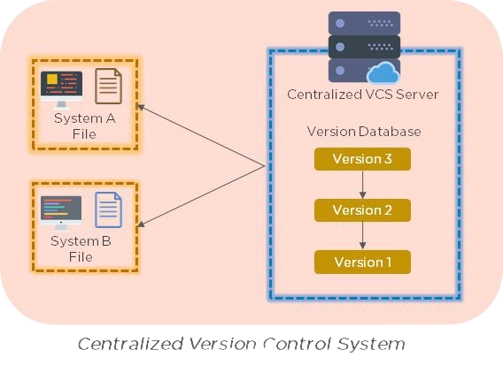

<!DOCTYPE html>
<html>
<head>
    
</head>
<body>

### Централизованная VCS

---

**CVCS-*Это условное место(центральное), в котором хранятся все версии файлов, и к которому имеют доступ все причатстные люди.***

---

**Минусы CVCS:**

1. Одна точка отказа:
В CVCS весь репозиторий хранится на центральном сервере. Если сервер становится недоступным, все разработчики теряют доступ к истории, веткам и новым изменениям. Это создает одну точку отказа.

2. Зависимость от доступа к сети:
Для совершения большинства операций в CVCS требуется доступ к центральному серверу через сеть. Это может быть проблемой в случае отсутствия подключения или низкой пропускной способности сети.

3. Сложность восстановления данных:
Если центральный репозиторий повреждается, восстановление данных может быть затруднено. Без регулярных резервных копий существует риск потери целой истории проекта.

---

* [назад в прошлый раздел](./vcs.md "назад в прошлый раздел")

* [назад в меню](./readme.md "назад в меню")