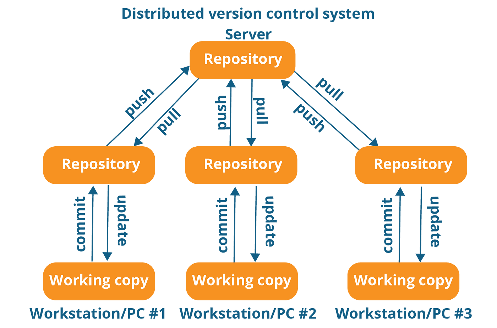

<!DOCTYPE html>
<html>
<head>
    
</head>
<body>

### Распределенная VCS(GIT)

---

*В распределённых системах контроля версий **(DVCS)**, каждый разработчик получает полный клон репозитория **(хранилище с файлами)**, включая всю историю изменений (все снимки файлов) на определенный момент времени.*

---

**Плюсы DVCS:**

1. Работа в оффлайн-режиме:
Одним из основных преимуществ DVCS является способность работать в оффлайн-режиме. Разработчики могут выполнять коммиты, создавать ветки и проводить другие операции даже без подключения к центральному репозиторию.

2. Быстрое клонирование репозитория:
Клонирование репозитория в DVCS обычно происходит быстрее, чем в централизованных системах. Это особенно полезно при начале работы с новым проектом или когда необходимо быстро создать копию репозитория.

3. Легкость отката изменений:
В DVCS легко откатить изменения до предыдущего состояния. Это позволяет быстро исправлять ошибки, возвращаться к предыдущим версиям кода и управлять историей проекта.

4. Более безопасное хранение данных:
Каждый клон репозитория в DVCS содержит полную историю проекта. Это делает хранение данных более надежным, поскольку каждый клон содержит всю информацию и может быть использован для восстановления.

5. Повышенная безопасность:
Так как у каждого разработчика есть полная копия репозитория, это увеличивает уровень безопасности. Даже при сбое центрального сервера данные сохранены в локальных репозиториях разработчиков.

6. Поддержка совместной работы:
DVCS облегчают совместную работу нескольких разработчиков, позволяя каждому работать в своей ветке, а затем легко объединять свои изменения с основным репозиторием.

---

* [назад в прошлый раздел](./vcs.md "назад в прошлый раздел")

* [назад в меню](./readme.md "назад в меню")