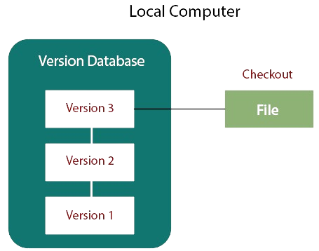

<!DOCTYPE html>
<html>
<head>
    
</head>
<body>

### Что такое система контроля версий 
---
*Система контроля версий* **(VCS)***-это  система для учета изменения файла или файлов по мере работы с ними*. Она позволяет в любой момент вернуться к любому из состояний файлов до последних изменений.

    Пример:
    Допустим вы пишите решение какой то задачи в виде кода на каком то языке программирования, которое состоит из одного файла.Если бы вы не использовали систему контроля версий, вам бы пришлось каждый раз придумывать как же в этот раз назвать новую версию решения, что в какой то момент, стало бы не слишком удобно.Ситема контроля версий позволяет вам автоматически сохранить изменение решения на каждом этапе, чтобы в дальнейшем была возможность выбирать между версиями решения.

---

**Плюсы использования VCS:**

1. Отслеживание изменений:
Система контроля версий (СКВ) отслеживает изменения в файлах, записывая каждую версию файла в хранилище. Это позволяет пользователям откатываться к предыдущим версиям, а также объединять изменения, вносимые несколькими пользователями.

2. Работа в команде:
СКВ позволяет нескольким разработчикам одновременно работать над проектом, управляя конфликтами и интегрируя изменения в единое целое. Каждый разработчик может работать в своей ветке и объединять свои изменения с общим кодом.

3. Отслеживание истории:
Система контроля версий сохраняет историю изменений, что полезно для аудита, отслеживания причин изменений и восстановления случайно удаленных данных.

4. Эффективное управление проектом:
Использование СКВ упрощает управление проектом, обеспечивает надежность и облегчает совместную работу над проектами любого масштаба.
---
### Мотивации и выды VCS
Одна из проблем, с которой люди столкнулись при попытки контроля версий-человеческий фактор.При работе с файлами или папками,  можно банально забыть или перепутать то с чем и где вы работате, и сделать что то нехорошее.Для решения этой проблемы были разработаны локальные VCS, которые хранят все файлы и папки, и их историю изменений в виде простой базы данных.Пример такой локальной быза на картинке ниже.

**Виды VCS**:
1. [CVCS](./cvcs.md "централизованная VCS")
2. [DVCS](./dvcs.md "распределенная VCS")

---

* [назад в меню](./readme.md "назад в меню")